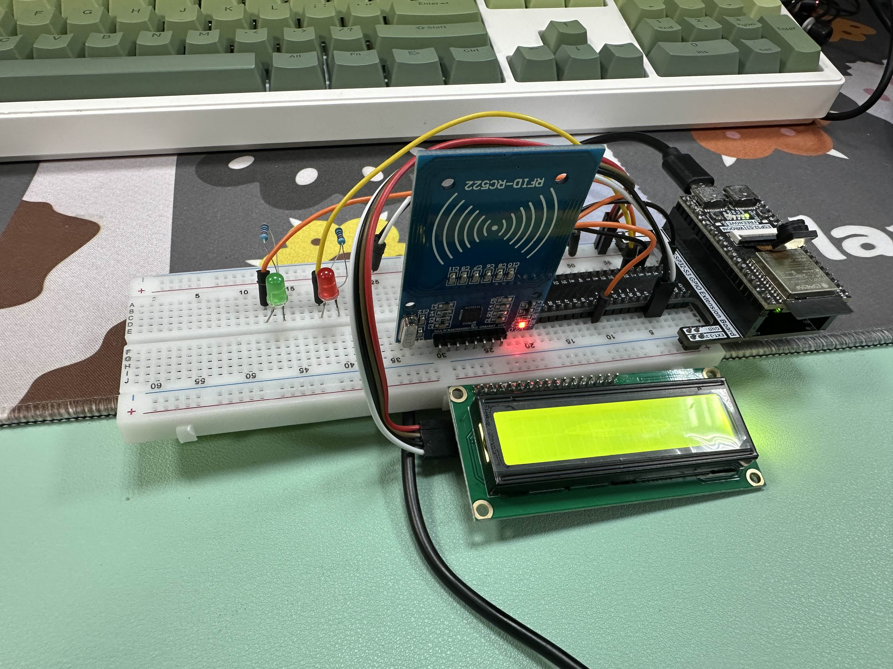
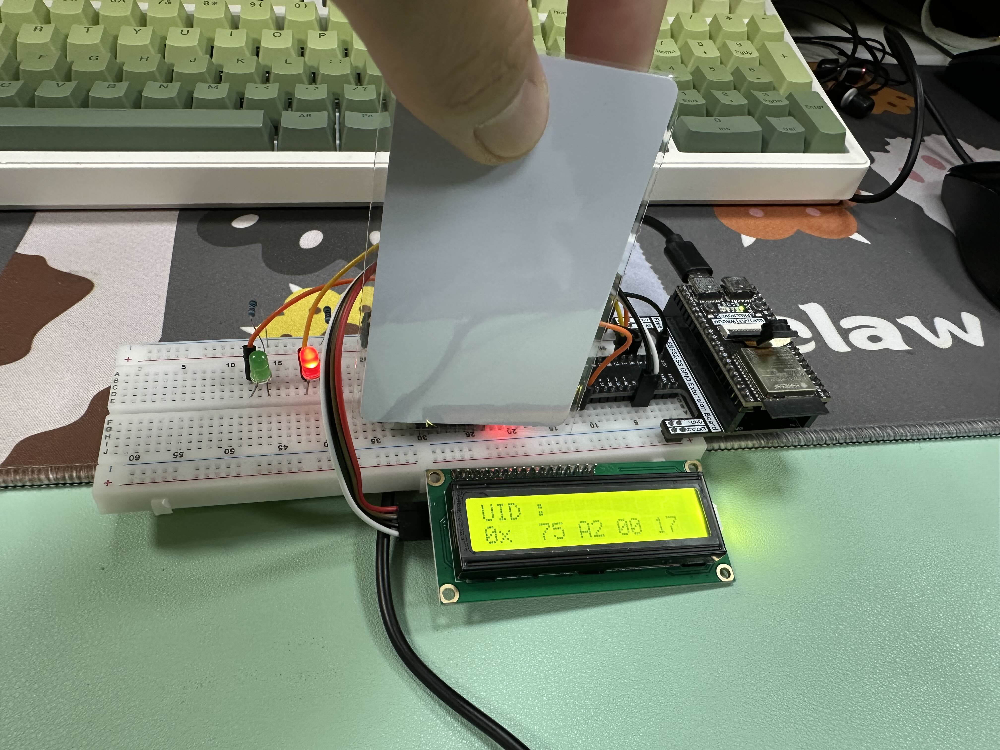
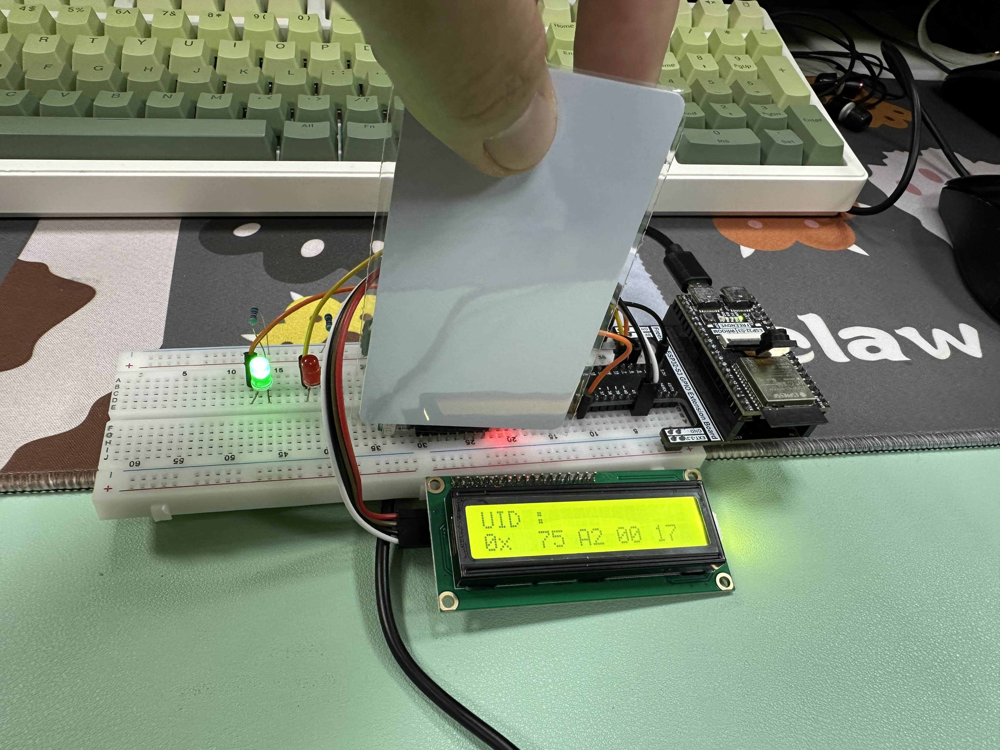

# ID_cloner

Board : ESP32-S3
using RC522 sensor clone the ic card UID to another new card

## RFID
- install library
    - LiquidCrystal
    - MFRC522
- setup sensor
    - I2C LCD display
    - rc522
        ``` cpp
            // using print pin info to check these pin number
            Serial.print("MOSI: ");
            Serial.println(MOSI);
            Serial.print("MISO: ");
            Serial.println(MISO);
            Serial.print("SCK: ");
            Serial.println(SCK);
        ```

## result

- when boot up



- scan original card to record uid, than red light lights on means you can scan the new card and write the UID into it's block 0



- when the green light lights on means the UID is copy completely

